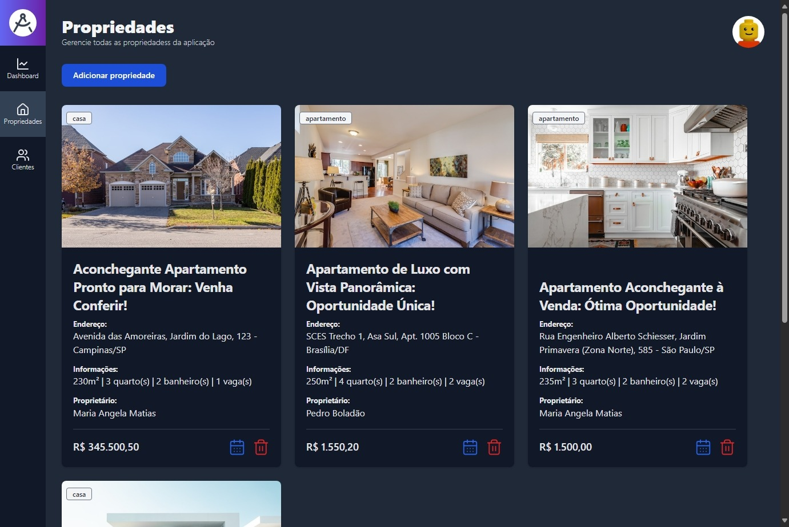

# Sua Casa
Plataforma de gerenciamento de propriedades, projetada especialmente para imobiliárias que buscam oferecer um serviço excepcional aos seus clientes.



## Principais funcionalidades
- **Gerenciamento de propriedades:** criação e exclusão de propriedades de diversos tipos, como casas, apartamentos, lotes, etc;
- **Gerenciamento de clientes:** criação e exclusão de clientes;
- **Agendamento de visitas:** agende e marque visitas as propriedades da plataforma;
- **Dashboard:** principais informações da aplicação.

## Arquitetura de comunição com serviços


## Como rodar o projeto

#### LOCALMENTE

>**Importante instalar o Node em sua maquina**  [Link para instalar o Node](https://nodejs.org/en/download/package-manager/current)

Primeiramente temos que instalar as dependências do projeto com o seguinte comando:
  ```
  npm install
  ```
depois que as dependências foram instaladas, podemos executar o projeto com o comando:
  ```
  npm run dev
  ```
e abra o [http://localhost:5001/](http://localhost:3000/) no navegador para verificar a aplicação em execução.

---
#### DOCKER
Primeiro crie a imagem com o seguinte comando:
```
  docker build -t front .
```

depois rode a imagem com o seguinte comando:
```
  docker run -p 0.0.0.0:3000:3000 --name front front
```

e abra o [http://localhost:5001/](http://localhost:3000/) no navegador para verificar a aplicação em execução.